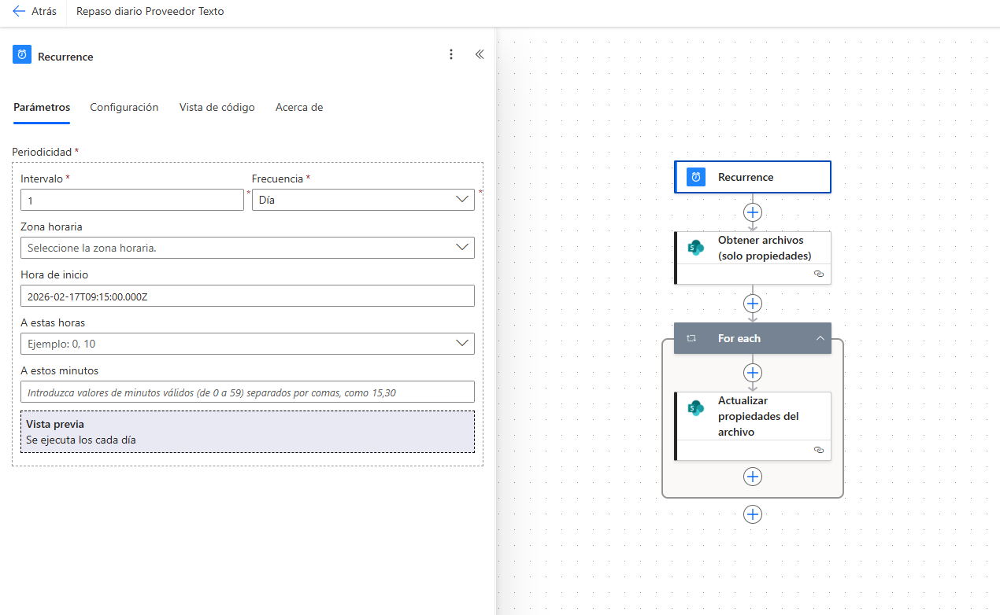
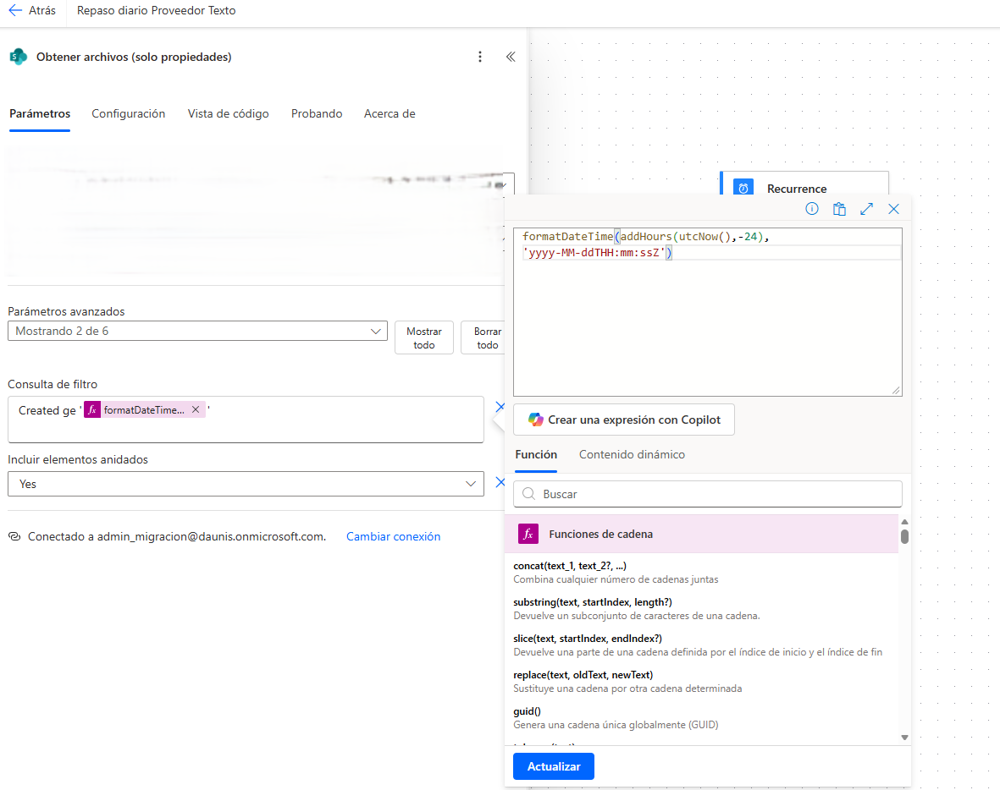
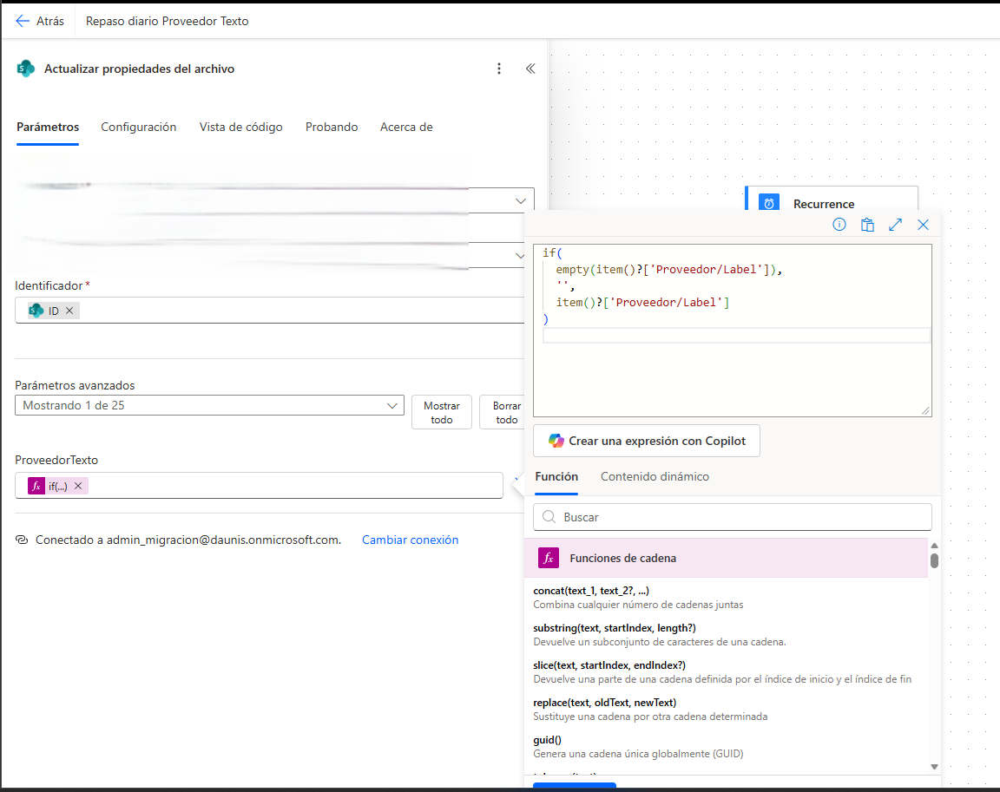

# SharePoint Metadata Automation with Power Automate

Automatización en Power Automate orientada a actualizar metadatos de archivos en SharePoint de forma periódica.

## Descripción

Este proyecto consiste en un flujo de Power Automate diseñado para revisar archivos en SharePoint y actualizar automáticamente una propiedad de texto a partir de un valor existente en los metadatos del archivo.

La automatización permite:
- ejecutarse de forma diaria
- consultar archivos de SharePoint
- filtrar elementos recientes
- recorrer automáticamente los archivos encontrados
- actualizar propiedades del archivo sin intervención manual

## Objetivo

El objetivo del flujo fue automatizar la actualización de metadatos en SharePoint para evitar tareas manuales repetitivas y mantener la información de los archivos más consistente.

## Tecnologías utilizadas

- Power Automate
- SharePoint
- Microsoft 365
- Expresiones dinámicas
- Automatización de procesos

## Flujo de funcionamiento

1. El flujo se ejecuta automáticamente mediante una recurrencia diaria.
2. Se consultan archivos de SharePoint usando la acción "Obtener archivos (solo propiedades)".
3. Se filtran los archivos recientes mediante una consulta por fecha.
4. Se recorren los resultados con un bloque `For each`.
5. Se actualiza la propiedad del archivo usando una expresión para asignar el valor correspondiente.

## Lógica implementada

### Trigger programado
El flujo está configurado para ejecutarse automáticamente con una recurrencia diaria.

### Filtro por fecha
Se consulta únicamente la información necesaria y se aplica un filtro temporal para trabajar con archivos recientes.

### Actualización de metadatos
Se actualiza una propiedad de texto en el archivo en función del valor disponible en otro campo del elemento.

### Expresión condicional
Se utiliza una expresión que:
- deja el valor vacío si el campo origen está vacío
- copia el valor si el campo existe

## Capturas del proyecto

## 1. Vista general del flujo
Resumen visual del flujo completo en Power Automate.

## 2. Trigger de recurrencia
Configuración del disparador programado que ejecuta la automatización diariamente.

## 3. Filtro por fecha en SharePoint
Consulta aplicada para trabajar solo con archivos recientes.

## 4. Expresión para actualizar metadatos
Lógica usada para asignar el valor del campo de texto de forma segura.

## Resultados

Con esta automatización se consiguió:
- reducir trabajo manual
- mantener metadatos actualizados de forma automática
- trabajar únicamente sobre archivos recientes
- mejorar consistencia en la información almacenada en SharePoint
- aplicar lógica de transformación simple dentro del flujo

## Qué he hecho yo

En este proyecto me encargué de:
- diseñar el flujo en Power Automate
- configurar el trigger programado
- consultar archivos desde SharePoint
- aplicar filtros por fecha
- implementar la lógica de actualización de propiedades
- usar expresiones dinámicas para controlar valores vacíos
- validar el funcionamiento del flujo

## Notas

Por motivos de confidencialidad, las capturas publicadas en este repositorio han sido anonimizadas y no incluyen información sensible del entorno original.

## Autor

**Ibrahem Laktibi**
